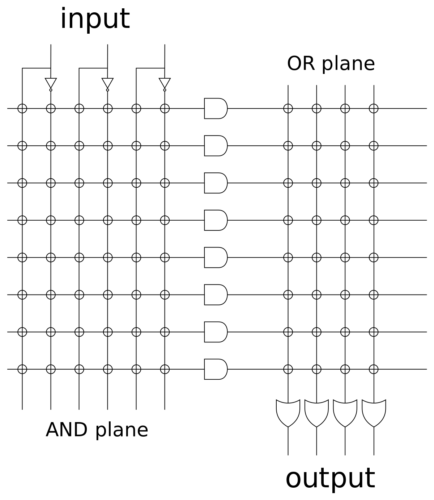
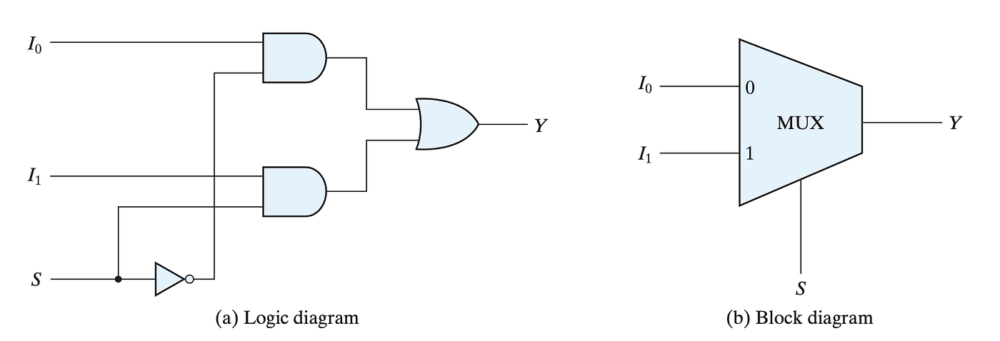

# C&oacute;digo tangible
El extra&ntilde;o mundo del hardware escrito (_VHDL_)
- Mota Sosa Jorge Alejandro
- L&oacute;pez Higuera Tom&aacute;s

---

<!-- .element: data-auto-animate -->
## P L D


<!-- .element: data-auto-animate -->
## P L D <!-- .element: style="color: red;" -->
<!-- .element: data-auto-animate -->
**P**rogrammable <!-- .element: style="color: red;" -->
**L**ogic <!-- .element: style="color: red;" -->
**D**evice <!-- .element: style="color: red;" -->


<!-- .element: data-auto-animate -->
## P L D <!-- .element: style="color: red;" -->
<!-- .element: data-auto-animate -->
**D**ispositivo <!-- .element: style="color: red;" -->
**L**&oacute;gico <!-- .element: style="color: red;" -->
**P**rogramable <!-- .element: style="color: red;" -->


 <!-- .element: width="400" -->


<!-- .element: data-auto-animate -->
- PROM
- PAL
- PLA
Nota: lista de arquitecturas de pld


<!-- .element: data-auto-animate -->
- PROM
- PAL
- PLA <!-- .element: class="r-fit-text" style="background: yellow;" -->


<!-- .element: data-auto-animate -->
## P L A


<!-- .element: data-auto-animate -->
## P L A <!-- .element: style="color: red;" -->
<!-- .element: data-auto-animate -->
**P**rogrammable <!-- .element: style="color: red;" -->
**L**ogic <!-- .element: style="color: red;" -->
**A**rray <!-- .element: style="color: red;" -->


<!-- .element: data-auto-animate -->
## P L A <!-- .element: style="color: red;" -->
<!-- .element: data-auto-animate -->
**M**atriz <!-- .element: style="color: red;" -->
**L**&oacute;gica <!-- .element: style="color: red;" -->
**P**rogramable <!-- .element: style="color: red;" -->


 <!-- .element: width="500" -->

---

<!-- .element: data-auto-animate -->
##  F P G A


<!-- .element: data-auto-animate -->
##  F P G A <!-- .element: style="color: red;" -->
<!-- .element: data-auto-animate -->
**F**ield <!-- .element: style="color: red;" -->
**P**rogrammable <!-- .element: style="color: red;" -->
**G**ate <!-- .element: style="color: red;" -->
**A**rray <!-- .element: style="color: red;" -->


<!-- .element: data-auto-animate -->
##  F P G A <!-- .element: style="color: red;" -->
<!-- .element: data-auto-animate -->
**M**atriz de <!-- .element: style="color: red;" -->
**P**uertas L&oacute;gicas <!-- .element: style="color: red;" -->
**P**rogramable en <!-- .element: style="color: red;" -->
**C**ampo <!-- .element: style="color: red;" -->


Nota: algunas personas confunden el FPGA con la tarjeta pensando que es lo mismo que si le dijera Arduino a la placa de Arduino, cuando en realidad hace referencia al chip, el que se muestra ahora mismo, es un FPGA de la marca altera. Como curiosidad, altera fue la primera en producir de manera comercial este chip.


Nota: la arquitectura de un FPGA es compleja, con diversos módulos. Para esta presentación, se ocupará esta simplificación con solo dos bloques: el bloque lógico configurable (LB) y el bloque de entrada-salida (IOB). En el caso de los bloques de estrada-salida no es complicado imaginar su uso, siendo este el recibir y regresar señales, en cambio, los bloques lógico configurables son una historia completamente distinta.


Nota: pensemos cada bloque lógico configurable como algo conocido, una protoboard. El propósito de estas tablas de prueba es construir circuitos electrónicos de diversa índole, aunque en este caso, los que nos compete son los lógicos. En una protoboard, nosotros colocamos los componentes, energizamos nuestro circuito, vemos su comportamiento y al finalizar, si lo deseamos, podemos desmontarlo todo y reacomodarlo a nuestras necesidades. En el bloque lógico programable es virtualmente lo mismo, claro está que en este no podremos montar como tal los componentes debido al tamaño, sin embargo, podemos hacer que se comporte igual, así como interconectarlos entre sí para generar circuitos mas complejos a partir de sub-circuitos.


 <!-- .element: width="500" -->
Nota: Nosotros podríamos hacer uso del lenguaje máquina, sin embargo, teniendo en cuenta que un FPGA está diseñado para realizar pruebas de circuitos lógicos, esta solución resulta inviable por el tiempo que tomaría realizar.


Nota: Otra forma seria por medio del set de intrucciones que tiene el chip para manejar registros, dicho de otra forma, el leguaje ensamblador especifico del chip, y aun cuando esta solucion nos ahorraria horas de trabajo, sigue tomando mucho tiempo. Descartado estas opciones, ¿Que nos queda?, por supuesto, lo que nos queda son los lenguajes de alto nivel.


Nota: Recordando lo visto en la materia de fundamentos de programación, un lenguaje de programación es de mayor nivel mientras más se acerque al lenguaje humano. De estos hay muchos, los que primero se nos pueden venir a la mente pueden ser toda la familia de C, Java, tal vez Python. Si bien, puede ser una solución hacer uso de un lenguaje de propósito general para realizar esta labor, lo idóneo sería hacer uso de un lenguaje específico, que al igual que con lo que pasa con SQL, un lenguaje específico para bases de datos, existiera uno que solo se use para generar estos circuitos. Afortunadamente, este lenguaje existe, su nombre es VHDL.

---

<!-- .element: data-auto-animate -->
## V H D L


<!-- .element: data-auto-animate -->
## V H S I C - H D L


<!-- .element: data-auto-animate -->
## V H S I C - H D L <!-- .element: style="color: red;" -->
**V**ery <!-- .element: style="color: red;" -->
**H**igh <!-- .element: style="color: red;" -->
**S**peed <!-- .element: style="color: red;" -->
**I**ntegrated <!-- .element: style="color: red;" -->
**C**ircuit <!-- .element: style="color: red;" -->
**H**ardware <!-- .element: style="color: red;" -->
**D**escriptic <!-- .element: style="color: red;" -->
**L**enguaje <!-- .element: style="color: red;" -->


<!-- .element: data-auto-animate -->
## V H D L <!-- .element: style="color: red;" -->
<!-- .element: data-auto-animate -->
**V**ery <!-- .element: style="color: red;" -->
**H**igh <!-- .element: style="color: red;" -->
**D**escriptic <!-- .element: style="color: red;" -->
**L**enguaje <!-- .element: style="color: red;" -->


<!-- .element: data-auto-animate -->
## V H D L <!-- .element: style="color: red;" -->
<!-- .element: data-auto-animate -->
**L**enguaje <!-- .element: style="color: red;" -->
**D**escriptivo de <!-- .element: style="color: red;" -->
**A**lto <!-- .element: style="color: red;" -->
**N**ivel <!-- .element: style="color: red;" -->


 <!-- .element: width="500" -->
Nota: Originalmente, el lenguaje VHDL fue desarrollado por el departamento de defensa de los Estados Unidos a inicios de los años 80 basado en el lenguaje de programación ADA con el fin de simular circuitos eléctricos digitales.

---

## Ejemplo





```vhdl[1-26|1-2|4|13|4-11|4,11|6-9|13-26|13,15,26|17-24|17,18,24|19-23]
library ieee;
use ieee.std_logic_1164.all;

entity mux2a1 is

    port (i0 : in  std_logic;
          i1 : in  std_logic;
          s  : in  std_logic;
          y  : out std_logic);

end mux2a1;

architecture Behavioral of mux2a1 is

begin

    comb : process (i0, i1, s)
    begin
        if (s = '0') then
            y <= i0;
        else
            y <= i1;
        end if;
    end process;

end Behavioral;
```
Nota: entity: variables ; architecture: funcionamiento
